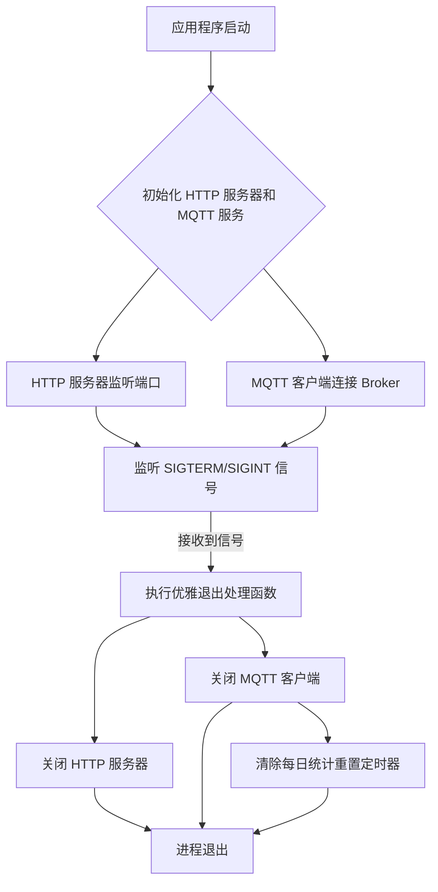

# 优雅退出实现计划

**目标：** 确保在接收到终止信号时，HTTP 服务器和 MQTT 客户端能够优雅地关闭，从而避免Docker停止容器时等待时间过长。

**步骤：**

1.  **修改 `src/mqttService.ts`：**
    *   导出一个 `closeMqttClient` 函数，用于断开 MQTT 连接并清除 `dailyResetInterval`。
    *   修改 `initMqttService`，使其返回 `mqttClient` 实例，或者确保 `mqttClient` 可以在模块外部访问（目前已是模块级别变量，但需要一个关闭函数）。

2.  **修改 `src/index.ts`：**
    *   导入 `closeMqttClient` 函数。
    *   在 `server.listen` 之后，添加信号处理逻辑，监听 `SIGTERM` 和 `SIGINT` 信号。
    *   在信号处理函数中，首先关闭 HTTP 服务器，然后调用 `closeMqttClient`。
    *   确保在所有连接关闭后，进程退出。

**详细计划图：**



**具体代码修改思路：**

*   **`src/mqttService.ts`**
    ```typescript
    // ... 现有代码 ...

    export const closeMqttClient = async () => {
      if (dailyResetInterval) {
        clearInterval(dailyResetInterval);
        dailyResetInterval = null;
        console.log(chalk.green('每日统计重置定时器已清除。'));
      }
      if (mqttClient && mqttClient.connected) {
        await new Promise<void>((resolve) => {
          mqttClient?.end(false, () => { // false 表示不强制关闭，等待消息发送完成
            console.log(chalk.green('MQTT 客户端已断开连接。'));
            resolve();
          });
        });
      } else if (mqttClient) {
        console.log(chalk.yellow('MQTT 客户端未连接或已关闭。'));
      }
    };

    // ... 现有代码 ...
    ```

*   **`src/index.ts`**
    ```typescript
    import http from 'http';
    import { PORT, HOST, TARGET_IP, TARGET_PORT, TARGET_DOMAIN } from './config';
    import { LogLevel } from './config';
    import { initMqttService, closeMqttClient } from './mqttService'; // 导入 closeMqttClient
    import { setupProxy } from './proxyHandler';
    import chalk from 'chalk';

    // 初始化 MQTT 服务
    initMqttService();

    // 监听代理请求
    const server = http.createServer((req, res) => {
      setupProxy(req, res);
    });

    server.listen(PORT, HOST, () => {
      console.log(chalk.green(`代理服务器正在监听 http://${HOST}:${PORT}，代理到 https://${TARGET_IP}:${TARGET_PORT} (Host: ${TARGET_DOMAIN})`));
    });

    // 优雅退出处理
    const gracefulShutdown = async () => {
      console.log(chalk.blue('收到终止信号，开始优雅退出...'));

      // 关闭 HTTP 服务器
      await new Promise<void>((resolve) => {
        server.close((err) => {
          if (err) {
            console.error(chalk.red('关闭 HTTP 服务器时发生错误:'), err);
            resolve(); // 即使有错误也继续
          } else {
            console.log(chalk.green('HTTP 服务器已关闭。'));
            resolve();
          }
        });
      });

      // 关闭 MQTT 客户端
      await closeMqttClient();

      console.log(chalk.green('所有服务已关闭，进程退出。'));
      process.exit(0);
    };

    // 监听终止信号
    process.on('SIGTERM', gracefulShutdown);
    process.on('SIGINT', gracefulShutdown);
