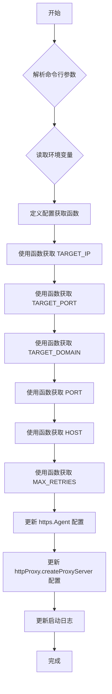

# 代理服务器配置动态化计划

## 目标

将 `src/index.ts` 中的硬编码配置项 (`TARGET_IP`, `TARGET_PORT`, `TARGET_DOMAIN`, `PORT`, `HOST`, `MAX_RETRIES`) 替换为通过环境变量或命令行参数动态获取。

## 方案概述

我们将使用 `process.env` 来读取环境变量，并使用 `minimist` 库来解析命令行参数。如果环境变量和命令行参数都存在，命令行参数将优先。`TARGET_IP` 和 `TARGET_DOMAIN` 之间存在联动关系：如果其中一个未设置（即使用了默认值），则使用另一个的值；如果两者都未设置，则使用默认值。

## 详细步骤

1. **安装依赖：**
    * 安装 `minimist` 用于解析命令行参数。

2. **修改 `src/index.ts`：**
    * 导入 `minimist`。
    * 定义一个函数来获取配置值，该函数将检查命令行参数，然后检查环境变量，并提供默认值。
    * 将 `TARGET_IP`、`TARGET_PORT`、`TARGET_DOMAIN`、`PORT`、`HOST` 和 `MAX_RETRIES` 的定义替换为调用此函数来获取值。
    * 更新 `https.Agent` 和 `httpProxy.createProxyServer` 中的相关配置，确保它们使用动态获取的值。
    * 更新启动日志信息，以反映配置值的来源。

## Mermaid 流程图



## 具体代码修改思路

1. **安装 `minimist`:**

    ```bash
    bun add minimist
    ```

2. **`src/index.ts` 修改：**

    * **导入 `minimist`:**
        在文件顶部添加：

        ```typescript
        import minimist from 'minimist';
        ```

    * **获取命令行参数:**
        在现有变量定义之前添加：

        ```typescript
        const argv = minimist(process.argv.slice(2), {
          alias: {
            p: 'port',
            h: 'host',
            r: 'maxRetries',
            i: 'targetIp',
            d: 'targetDomain'
          }
        });
        ```

    * **定义配置获取函数和变量:**
        替换现有变量的定义：

        ```typescript
        const getConfig = (envVar: string, argName: string, defaultValue: string | number): { value: string | number, isDefault: boolean } => {
          if (argv[argName] !== undefined) {
            // 命令行参数优先
            return { value: typeof defaultValue === 'number' ? Number(argv[argName]) : String(argv[argName]), isDefault: false };
          }
          if (process.env[envVar] !== undefined) {
            // 环境变量次之
            return { value: typeof defaultValue === 'number' ? Number(process.env[envVar]) : String(process.env[envVar]), isDefault: false };
          }
          return { value: defaultValue, isDefault: true }; // 默认值
        };

        let targetIpConfig = getConfig('TARGET_IP', 'targetIp', 'example.com');
        let targetDomainConfig = getConfig('TARGET_DOMAIN', 'targetDomain', 'example.com');

        let TARGET_IP = targetIpConfig.value as string;
        let TARGET_DOMAIN = targetDomainConfig.value as string;

        // 如果其中一个没有设置，则默认使用对方的值
        if (targetIpConfig.isDefault && !targetDomainConfig.isDefault) {
          TARGET_IP = TARGET_DOMAIN;
        } else if (targetDomainConfig.isDefault && !targetIpConfig.isDefault) {
          TARGET_DOMAIN = TARGET_IP;
        }

        const TARGET_PORT = getConfig('TARGET_PORT', 'targetPort', 443).value as number;
        const PORT = getConfig('PORT', 'port', 25055).value as number;
        const HOST = getConfig('HOST', 'host', '0.0.0.0').value as string;
        const MAX_RETRIES = getConfig('MAX_RETRIES', 'maxRetries', 9).value as number;
        ```

    * **更新 `server.listen`:**
        将 `server.listen(PROXY_PORT, ...)` 修改为 `server.listen(PORT, HOST, ...)`。

## 验证方式

1. 通过命令行参数启动代理服务器，验证配置是否生效。
    `bun run src/index.ts --target-ip=1.2.3.4 --target-port=8080 --target-domain=example.com --port=3000 --host=0.0.0.0 --max-retries=5`
    或使用简写：
    `bun run src/index.ts -i 1.2.3.4 -d example.com -p 3000 -h 0.0.0.0 -r 5`
2. 通过环境变量启动代理服务器，验证配置是否生效。
    `TARGET_IP=5.6.7.8 TARGET_PORT=9090 TARGET_DOMAIN=test.com PORT=4000 HOST=127.0.0.1 MAX_RETRIES=3 bun run src/index.ts`
3. 同时使用命令行参数和环境变量，验证命令行参数是否优先。
    `TARGET_IP=5.6.7.8 bun run src/index.ts -i 1.2.3.4` (此时 `TARGET_IP` 应该是 `1.2.3.4`)
4. **测试联动逻辑：**
    * 只设置 `TARGET_IP`：`bun run src/index.ts -i 192.168.1.1` (此时 `TARGET_DOMAIN` 也会是 `192.168.1.1`)
    * 只设置 `TARGET_DOMAIN`：`bun run src/index.ts -d myapi.com` (此时 `TARGET_IP` 也会是 `myapi.com`)
    * 两者都不设置：`bun run src/index.ts` (此时 `TARGET_IP` 和 `TARGET_DOMAIN` 都会是 `example.com`)
