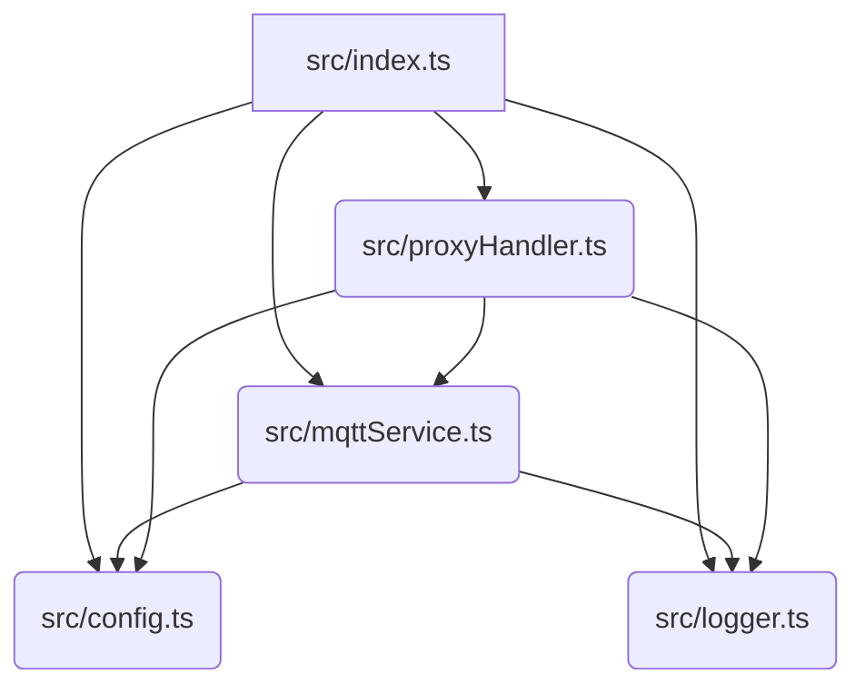

# 代码拆分计划

`src/index.ts` 文件目前包含的功能较多，为了提高代码的可读性、可维护性和模块化，我建议将其拆分为以下几个文件：

1.  **`src/config.ts`**: 负责处理命令行参数和环境变量，提供统一的配置访问接口。
2.  **`src/logger.ts`**: 定义日志级别和日志输出函数。
3.  **`src/mqttService.ts`**: 封装 MQTT 客户端的连接、发布以及相关的统计逻辑（请求、重试、成功计数和每日重置）。
4.  **`src/proxyHandler.ts`**: 包含 HTTP 代理服务器的核心逻辑，包括代理创建、错误处理、请求和响应事件监听（包括重试机制）。
5.  **`src/index.ts`**: 作为主入口文件，负责初始化配置、日志、MQTT 服务和代理服务器，并启动 HTTP 服务器。

## 文件结构概览

## 具体文件内容规划

1.  **`src/config.ts`**
    *   导入 `minimist`。
    *   定义 `LogLevel` 枚举。
    *   定义 `argv` 常量。
    *   定义 `getConfig` 函数。
    *   导出所有配置相关的常量（`TARGET_IP`, `TARGET_DOMAIN`, `TARGET_PORT`, `PORT`, `HOST`, `MAX_RETRIES`, `LOG_LEVEL`, `MQTT_BROKER_URL`, `MQTT_USERNAME`, `MQTT_PASSWORD`）。

2.  **`src/logger.ts`**
    *   导入 `prettyjson` 和 `chalk`。
    *   从 `src/config.ts` 导入 `LogLevel` 和 `LOG_LEVEL`。
    *   定义并导出 `log` 函数。

3.  **`src/mqttService.ts`**
    *   导入 `mqtt` 和 `chalk`。
    *   从 `src/config.ts` 导入 MQTT 相关的配置（`MQTT_BROKER_URL`, `MQTT_USERNAME`, `MQTT_PASSWORD`）。
    *   从 `src/logger.ts` 导入 `log` 和 `LogLevel`。
    *   定义并管理 `mqttClient` 实例。
    *   定义 `MQTT_TOPIC_PREFIX`。
    *   定义并管理统计变量（`dailyRequests`, `dailyRetries`, `dailySuccess`, `totalRequests`, `totalRetries`, `totalSuccess`）。
    *   定义并导出 `publishMqtt` 函数。
    *   定义并导出 `resetDailyStats` 函数。
    *   定义并导出 `scheduleDailyReset` 函数。
    *   包含 MQTT 客户端的连接和错误处理逻辑。
    *   提供一个初始化函数，用于在 `index.ts` 中调用以启动 MQTT 服务和调度每日统计重置。

4.  **`src/proxyHandler.ts`**
    *   导入 `http`, `https`, `http-proxy`, `net`, `chalk`。
    *   从 `src/config.ts` 导入 `TARGET_IP`, `TARGET_DOMAIN`, `TARGET_PORT`, `MAX_RETRIES`。
    *   从 `src/logger.ts` 导入 `log` 和 `LogLevel`。
    *   从 `src/mqttService.ts` 导入 `publishMqtt`。
    *   定义并管理 `requestRetryCounts` 和 `requestBodies`。
    *   定义 `agent`。
    *   定义 `proxy` 实例。
    *   定义并导出 `setupProxy` 函数，该函数将接收 `req` 和 `res`，并处理代理请求、响应、错误和重试逻辑。

5.  **`src/index.ts`**
    *   导入 `http`。
    *   从 `src/config.ts` 导入 `PORT`, `HOST`。
    *   从 `src/logger.ts` 导入 `log` 和 `LogLevel`。
    *   从 `src/mqttService.ts` 导入 `initMqttService` (假设 `mqttService.ts` 提供一个初始化函数)。
    *   从 `src/proxyHandler.ts` 导入 `setupProxy`。
    *   初始化 MQTT 服务。
    *   创建 HTTP 服务器 (`http.createServer`)，并在请求处理函数中调用 `setupProxy`。
    *   启动服务器 (`server.listen`)。

## 操作步骤

1.  创建 `src/config.ts` 文件，并将 `LogLevel` 枚举、`argv`、`getConfig` 函数以及所有配置相关的常量移动到该文件。
2.  创建 `src/logger.ts` 文件，并将 `log` 函数移动到该文件，并确保它能从 `config.ts` 获取 `LOG_LEVEL`。
3.  创建 `src/mqttService.ts` 文件，并将 MQTT 相关的变量、`publishMqtt`、`resetDailyStats`、`scheduleDailyReset` 函数以及 MQTT 客户端的初始化和事件处理逻辑移动到该文件。
4.  创建 `src/proxyHandler.ts` 文件，并将 `https.Agent`、`httpProxy.createProxyServer`、`proxy` 实例、`proxy.on` 事件监听器（`error`, `proxyReq`, `proxyRes`）以及 `requestRetryCounts` 和 `requestBodies` 移动到该文件。封装一个 `setupProxy` 函数来处理代理逻辑。
5.  修改 `src/index.ts`，使其导入新创建的模块，并作为主入口文件协调这些模块。
